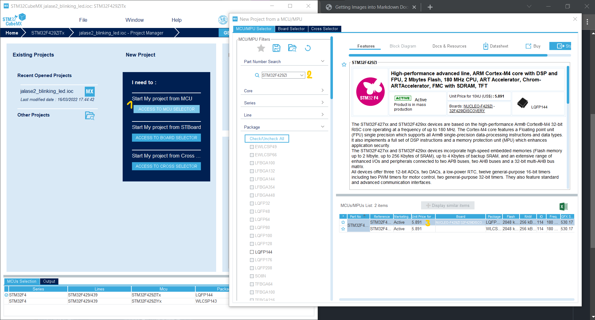
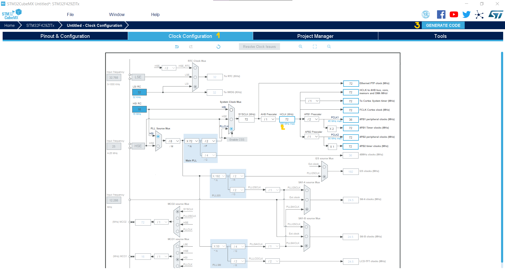
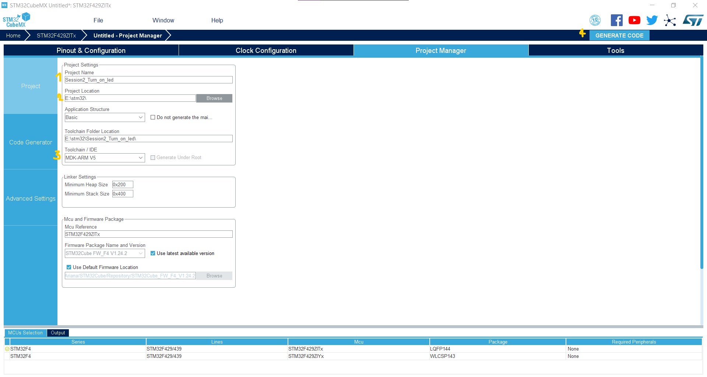
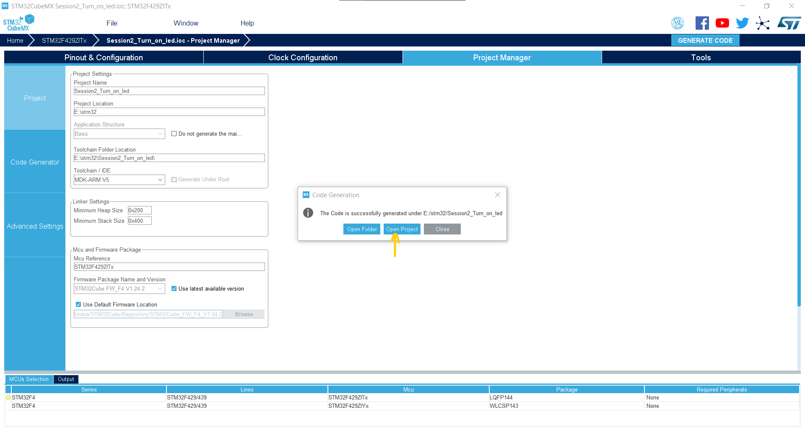
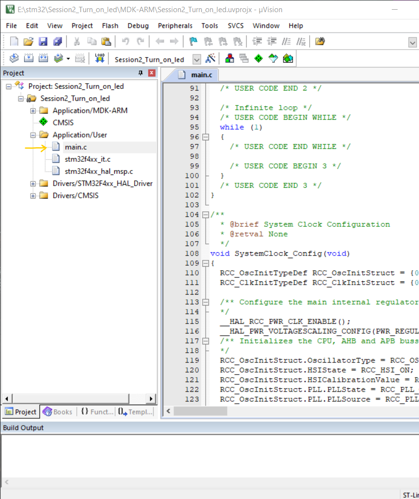
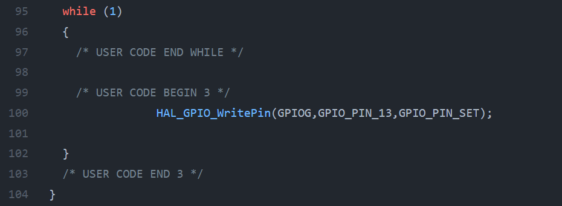

Before installing everything install `JAVARuntime` v1.8 or above. After that you need to install `STMCUBEMX`, `KEIL` and `STLINK`.

There are `3` steps to turn on LED(which is connected to `PG13` in `stm32f429zi` discovery board):
 - [x]  Run `STM32CubeMX` and choose MCU selector, and search the board that you are using.( I'm using STM32F429)
 <p align="center">
  
</p>

 - [x] On the `Clock Configuration` tab, set the the `HCLK` and `press Enter`, this can be set up to `180 MHz` in stm32f429.
  <p align="center">
  
</p>

 - [x] Then click on `Generate code` button and then in the new window(which will popup after clicking) set the path and name of the project and finally
 set the `Toolchain / IDE` to `MKD-ARM V5`.
   <p align="center">
   
</p>
 
 After these steps a window will popup and you can choose `Open project` to move your setup configurations to  `Keil`.
   <p align="left">
   
</p>

Then in `Keil` from the `project` window on the left, follow this path to get to the `main.c` file, `/Project:Session2_Turn_on_led/Session2_Turn_on_led/Application/user/main.c`.

   <p align="left">
   
</p>

Then look for `while(1)` loop and write yout code between `/* USER CODE BEGIN 3 */` and `  /* USER CODE END 3 */`. because we just want to turn on an led, we use one line code as bellow :
```
  HAL_GPIO_WritePin(GPIOG,GPIO_PIN_13,GPIO_PIN_SET);
```
   <p align="left">
   
</p>

* To turn on an led we can put this code before the `while(1)` and it will work as the same.

After that use `F7` to compile the code and then connect the discovery board to your pc and press `F8` to load code on the board. This code will set the PG13 led High and dose not do anything more :laughing:.

The whole code has been shared in this directory as `main.c`


