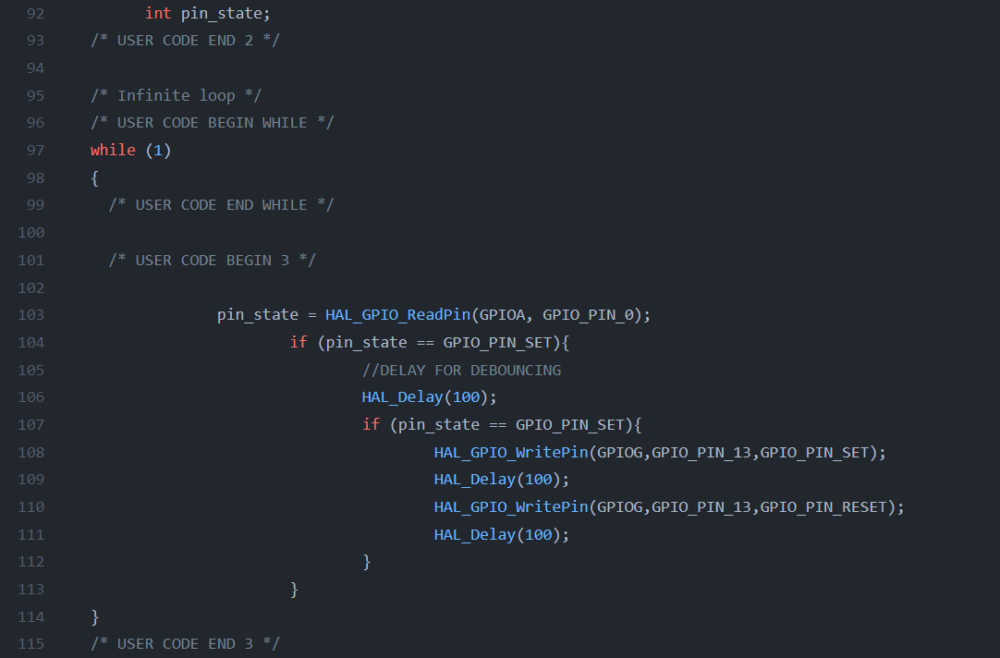

We want to `read` a pin as input and if the pin is `pressed`, then we want to `blink an LED`.

In order to read a pin we can use `User's key` which is available in discovery board or we can use a special pin to do that.

To find the `User's key` pin we should see the `schematic` of discovery board and find the circuit which is implemented for that use. picture above show the circuit in our board :
 
 

  

As we can see the `User pin` is normally connected to `GND` and it has the value `0`, but when we press the key, it will be connect to `VCC` through key's path and changes to `1`.

In oder to write our code we can use code as bellow, considering that the `HAL_Delay(100);` used for software debouncing and we use `ReadPin` method to read the pin's `state`.

 

  

