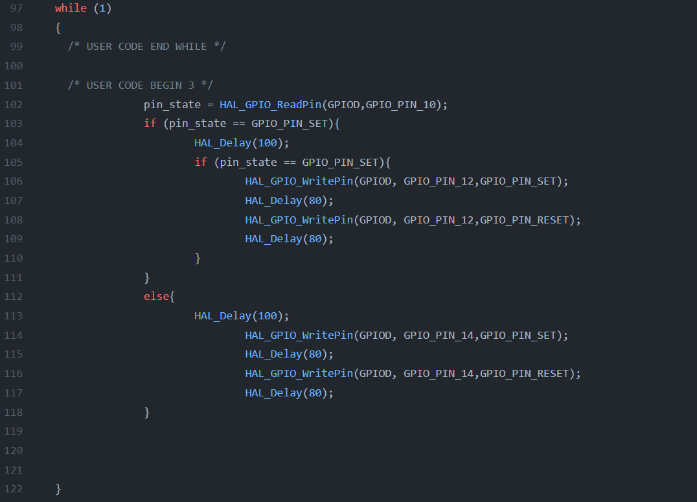

We want to write a code that when we press a `key`, `LED1` starts to blink and when we are not pressing the key, `LED2` starts to `blink` and `LED1` `stop` Blinking :

```
/* USER CODE BEGIN 2 */
	int pin_state;
  /* USER CODE END 2 */

  /* Infinite loop */
  /* USER CODE BEGIN WHILE */
  while (1)
  {
    /* USER CODE END WHILE */

    /* USER CODE BEGIN 3 */
		pin_state = HAL_GPIO_ReadPin(GPIOD,GPIO_PIN_10);
		if (pin_state == GPIO_PIN_SET){
			HAL_Delay(100);
			if (pin_state == GPIO_PIN_SET){
				HAL_GPIO_WritePin(GPIOD, GPIO_PIN_12,GPIO_PIN_SET);
				HAL_Delay(80);
				HAL_GPIO_WritePin(GPIOD, GPIO_PIN_12,GPIO_PIN_RESET);
				HAL_Delay(80);				
			}
		}
		else{
			HAL_Delay(100);
				HAL_GPIO_WritePin(GPIOD, GPIO_PIN_14,GPIO_PIN_SET);
				HAL_Delay(80);
				HAL_GPIO_WritePin(GPIOD, GPIO_PIN_14,GPIO_PIN_RESET);
				HAL_Delay(80);	
		}			
				
				
		
  }
  /* USER CODE END 3 */
}
```
<!--  <p align="center">
  
</p> -->

