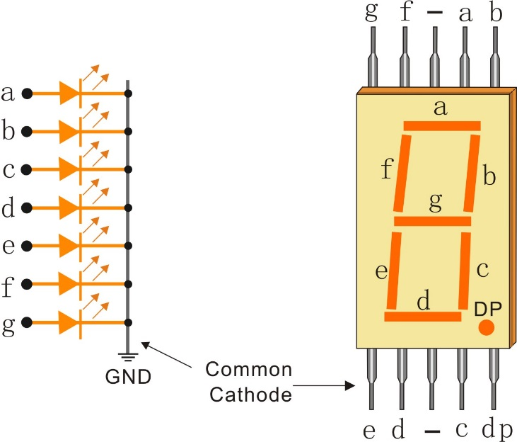

In order to setup `7-segment` we need to know the type of it, it can be `common-cathode` or `common-anode`. Each pin needs `220-Ohm` resistor and finaly we need to define a `char` that shows the equivalent setup of pins to show numbers on 7-segment. We want to `make a counter from 0 to 9`, consider `delay` between each number to see the result, otherwise we will not see any change in 7-segment.
In this case our 7-segment is common-cathod in the schme is as below:
 <p align="center">
  
</p>
The code is as below:

```c
  unsigned char x[]={0x3f,0x06,0x5b,0x4f,0x66,0x6d,0x7d,0x07,0x7f,0x67};

  /* USER CODE END 2 */

  /* Infinite loop */
  /* USER CODE BEGIN WHILE */
  while (1)
  {
    /* USER CODE END WHILE */

    /* USER CODE BEGIN 3 */
		for (int i=0;i<10;i++){
				GPIOD->ODR = x[i];
				HAL_Delay(500);
		}
  /* USER CODE END 3 */
}
```
