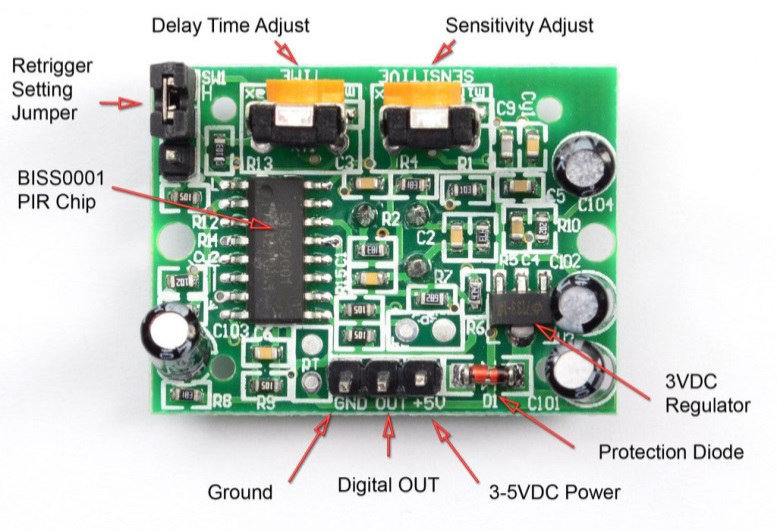

In order to setup PIR module, first we should know that this module has `3` pin,`VCC` and `GND` are input supply and the `OUTPUT` pin is digital output and when the module detect movement, it will change to `3.3v` and after a delay it will gose back to digital `0`.
It has two volume to change `Delay` time and `Sensivity`. The power supply is `5v` and it has a regulator to convert `5v` to `3.3v`.

The schematic is as below :

 <p align="center">
  
</p>

the code is as below :

```c
  while (1)
  {
    /* USER CODE END WHILE */

    /* USER CODE BEGIN 3 */
 	if (HAL_GPIO_ReadPin(GPIOD,GPIO_PIN_10)==GPIO_PIN_SET){
			HAL_GPIO_WritePin(GPIOG,GPIO_PIN_13,GPIO_PIN_SET);
			HAL_Delay(80);
			HAL_GPIO_WritePin(GPIOG,GPIO_PIN_13,GPIO_PIN_RESET);
			HAL_Delay(80);			
	}
		

  /* USER CODE END 3 */
}
```


