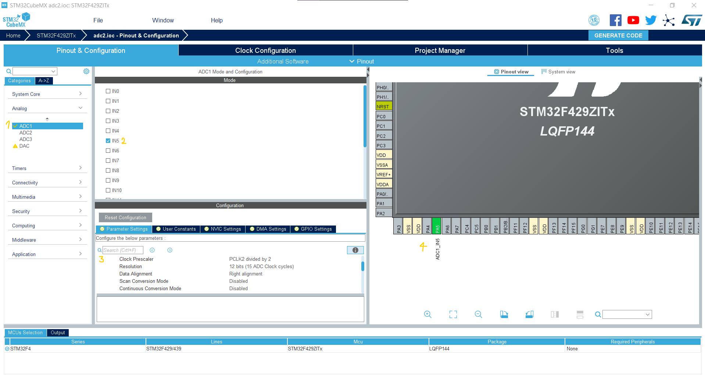
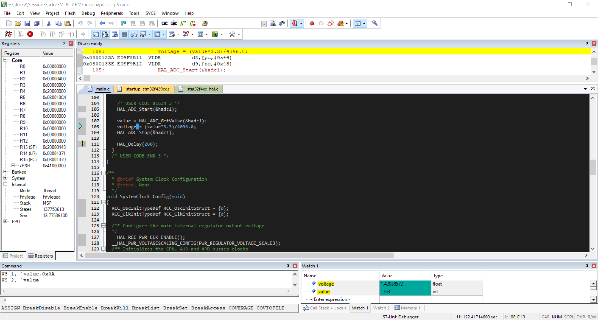

We want to configure the `ADC` peripheral and read `voltage` form and volume resistor and calculate the voltage acording to adc's output.
first we need to choose adc peripheral in `stm32cubemx` and in order to do that, we choose `adc` as below and we use `default setup` for it.
this adc is `12-bit`, it means that it can devide `0v to 3.3v` to `4096` part and measure it by this precise :
 <p align="center">
  
</p>

Next step is to enable the `adc1` and we do not specified that which channel we want to read, because we are using just one channel.but if we are using different channels, we need to specify the channel which we are using.

```c
HAL_ADC_Start(&hadc1);
```

To read the value on `PA5`(which is adc pin), we need to use the code as below and we store it in `value` which is a `global` variable :

```c
value = HAL_ADC_GetValue(&hadc1);
```
We can calculate the `voltage` according to `value`, note that be careful to define `4096.0`, not `4096` :

```c
voltage = (value*3.3)/4096.0;
```

we stop `adc` with the command as below and we use a delay to see the voltages more clearly with eyes :-) :

```c
HAL_ADC_Stop(&hadc1);
HAL_Delay(200);
```
Now we write our code, next step is to use `DEBUG` in `Keil` , we choose debug in keil and then we can add each `variables` to the `watch list`, and we can run the code and see the value of `voltage` or `value` in `watch list` :

 <p align="center">
  
</p>

the full code is as below :

```c
/* USER CODE BEGIN 0 */
int value;
float voltage;
/* USER CODE END 0 */

/**
  * @brief  The application entry point.
  * @retval int
  */
int main(void)
{
  /* USER CODE BEGIN 1 */
  /* USER CODE END 1 */
  

  /* MCU Configuration--------------------------------------------------------*/

  /* Reset of all peripherals, Initializes the Flash interface and the Systick. */
  HAL_Init();

  /* USER CODE BEGIN Init */

  /* USER CODE END Init */

  /* Configure the system clock */
  SystemClock_Config();

  /* USER CODE BEGIN SysInit */

  /* USER CODE END SysInit */

  /* Initialize all configured peripherals */
  MX_GPIO_Init();
  MX_ADC1_Init();
  /* USER CODE BEGIN 2 */

  /* USER CODE END 2 */

  /* Infinite loop */
  /* USER CODE BEGIN WHILE */
    while (1)
  {
    /* USER CODE END WHILE */

    /* USER CODE BEGIN 3 */
		HAL_ADC_Start(&hadc1);
		
		value = HAL_ADC_GetValue(&hadc1);
		voltage = (value*3.3)/4096.0;
    
		HAL_ADC_Stop(&hadc1);
			
		HAL_Delay(200);
  }
  /* USER CODE END 3 */
}
```


