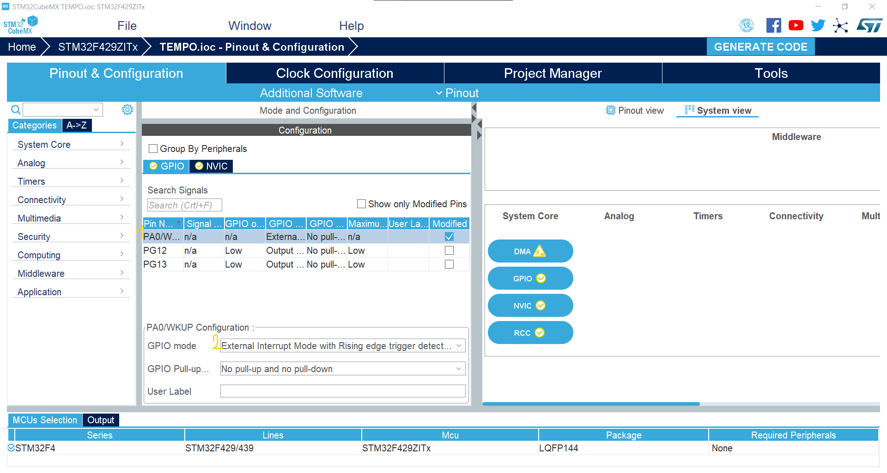
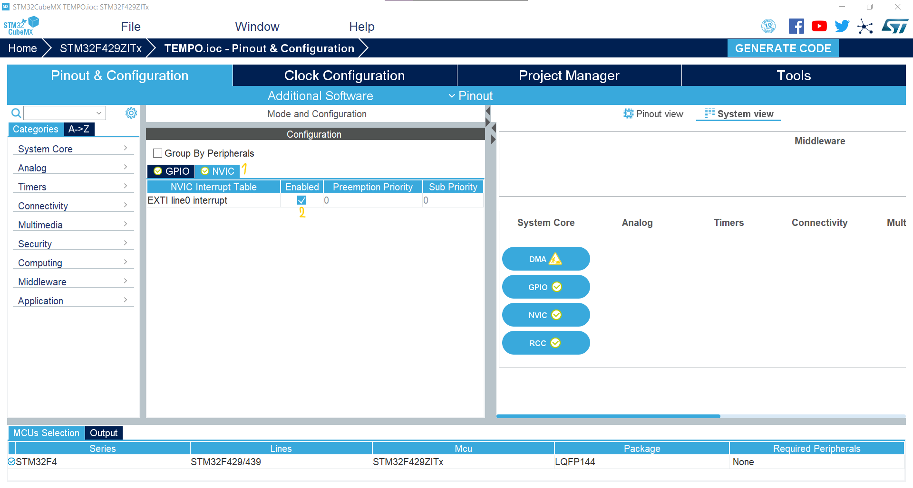

We want to use `interrupt` to `toggle` one led during another blinking for another led. To do this we need to `choose a pin` for `interrupt`. We have `15` pin for interrupt.
for interrupt `pin0` we can choose `PA0` or `PB0` or `PC0` or `PD0` or `PE0` or `PF0` or `PG0`.

`Note :
In order to make your code more readable and reusable, use macro for some variable and functions like delay and ..., it will help other people to understand what you have doneand it will help you to change pin or functions nore efficiently.`


After we choose the pin for interrupt, we need to setup some configurations for it, like `rising` or `falling` edge and ...
One important setup is to activate the `NVIC` interrupt to run interrupt, otherwise interrupt will not work.

 <p align="center">
  
</p>

 <p align="center">
  
</p>


Next step is to find the `void HAL_GPIO_EXTI_Callback(uint16_t GPIO_Pin)` in `stm32f4xx_hal_gpio.c`'s functions and copy the name and `make a functions` for interrupt with that.
In the function, we need to check which `pin` causes interrupt and if it was our port, we can do what ever we want in the function, note that our job in function should be `short` and `quick`,
if we have `slow` instruction in interrupt function, we can set a `flag` and do the function in `while(1)` when the `flag` is set.

The whole code is as below :

```c
/* USER CODE BEGIN PV */
void HAL_GPIO_EXTI_Callback(uint16_t GPIO_Pin) {
	if(GPIO_Pin == GPIO_PIN_0){
			HAL_GPIO_TogglePin(GPIOG,GPIO_PIN_12);
	}
 }
/* USER CODE END PV */

/* Private function prototypes -----------------------------------------------*/
void SystemClock_Config(void);
/* USER CODE BEGIN PFP */

/* USER CODE END PFP */

/* Private user code ---------------------------------------------------------*/
/* USER CODE BEGIN 0 */

/* USER CODE END 0 */

/**
  * @brief  The application entry point.
  * @retval int
  */
int main(void)
{
  /* USER CODE BEGIN 1 */

  /* USER CODE END 1 */
  

  /* MCU Configuration--------------------------------------------------------*/

  /* Reset of all peripherals, Initializes the Flash interface and the Systick. */
  HAL_Init();

  /* USER CODE BEGIN Init */

  /* USER CODE END Init */

  /* Configure the system clock */
  SystemClock_Config();

  /* USER CODE BEGIN SysInit */

  /* USER CODE END SysInit */

  /* Initialize all configured peripherals */
  MX_GPIO_Init();
  /* USER CODE BEGIN 2 */

  /* USER CODE END 2 */

  /* Infinite loop */
  /* USER CODE BEGIN WHILE */
  while (1)
  {
    /* USER CODE END WHILE */

    /* USER CODE BEGIN 3 */
		HAL_GPIO_WritePin(GPIOG,GPIO_PIN_13,GPIO_PIN_SET);
		HAL_Delay(500);
		HAL_GPIO_WritePin(GPIOG,GPIO_PIN_13,GPIO_PIN_RESET);
		HAL_Delay(500);		
  }
  /* USER CODE END 3 */
}
```
`Note` :

Becarefull to write interrupt code between the commented line as above to prevent deleting during changes in project.
