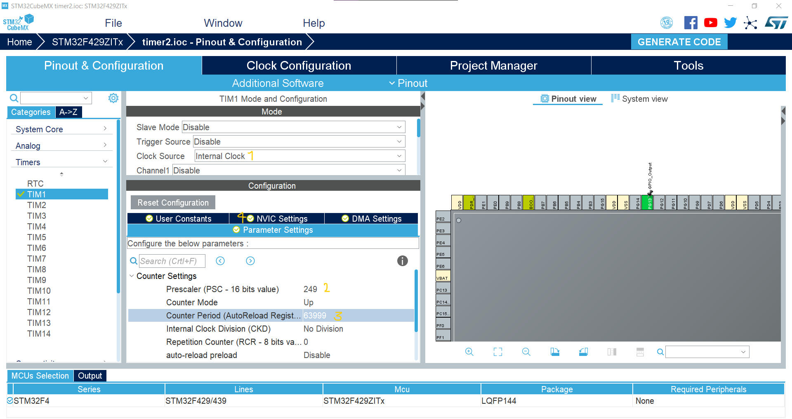
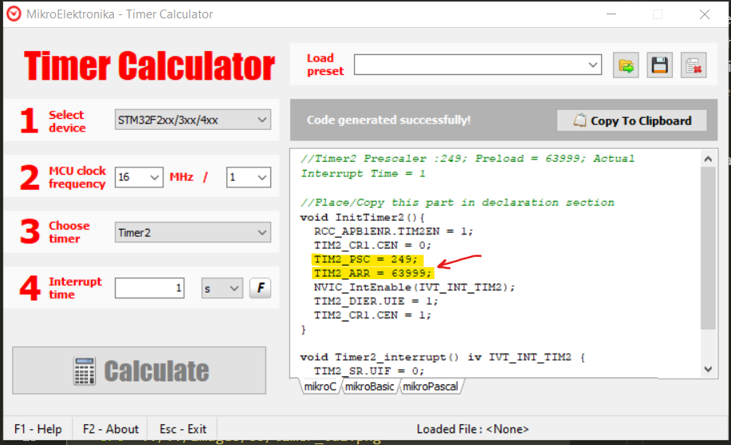

We want to setup a `timer` with interrupt, it will be overflow each `1second` and we will toggle `PG13` each time when interrupt function runs.

To setup a timer in `stm32cube` we can choose one of the available timers and set the register to congif the `prescaler` and `ARR` values and we need to specify the `clock source` and finally we have to activate the `TIM1 update interrupt and ....` in `NVIC Setting` . The setup window is as below :

 <p align="center">
  
</p>

To calculate the `ARR` and `PSC` values, we neeed to know the `Clock` of MCU, then we use the `Timer Calculator` app, the window of app is as below :

 <p align="center">
  
</p>

After that we will `Generate Project`. we use `void HAL_TIM_PeriodElapsedCallback(TIM_HandleTypeDef *htim)` to define our interrupt function which means what we want to do after each `1` second. this part's code as below :

```c
void HAL_TIM_PeriodElapsedCallback(TIM_HandleTypeDef *htim){
	if(htim->Instance == TIM1){
		HAL_GPIO_TogglePin(GPIOG,GPIO_PIN_13);
	}
}
```
in the functions we need to check if the `value of timer`(instance) is equal to predefinded value of `TIM1`, if it is we do what we want to do.

To `enable` timer, we need to use the code as below, otherwise the interrupt function will not work at all :
```c
	HAL_TIM_Base_Start_IT(&htim1);
```

Now our program is ready and each `1` second the interrupt function will be call and the led (which is connected to `PG13`) will be ON and OFF. The whole code is as below :

```c
/* USER CODE BEGIN Header */
/**
  ******************************************************************************
  * @file           : main.c
  * @brief          : Main program body
  ******************************************************************************
  * @attention
  *
  * <h2><center>&copy; Copyright (c) 2022 STMicroelectronics.
  * All rights reserved.</center></h2>
  *
  * This software component is licensed by ST under BSD 3-Clause license,
  * the "License"; You may not use this file except in compliance with the
  * License. You may obtain a copy of the License at:
  *                        opensource.org/licenses/BSD-3-Clause
  *
  ******************************************************************************
  */
/* USER CODE END Header */

/* Includes ------------------------------------------------------------------*/
#include "main.h"
#include "tim.h"
#include "gpio.h"

/* Private includes ----------------------------------------------------------*/
/* USER CODE BEGIN Includes */

/* USER CODE END Includes */

/* Private typedef -----------------------------------------------------------*/
/* USER CODE BEGIN PTD */
void HAL_TIM_PeriodElapsedCallback(TIM_HandleTypeDef *htim){
	if(htim->Instance == TIM1){
			HAL_GPIO_TogglePin(GPIOG,GPIO_PIN_13);
		}
}
/* USER CODE END PTD */

/* Private define ------------------------------------------------------------*/
/* USER CODE BEGIN PD */

/* USER CODE END PD */

/* Private macro -------------------------------------------------------------*/
/* USER CODE BEGIN PM */

/* USER CODE END PM */

/* Private variables ---------------------------------------------------------*/

/* USER CODE BEGIN PV */

/* USER CODE END PV */

/* Private function prototypes -----------------------------------------------*/
void SystemClock_Config(void);
/* USER CODE BEGIN PFP */

/* USER CODE END PFP */

/* Private user code ---------------------------------------------------------*/
/* USER CODE BEGIN 0 */

/* USER CODE END 0 */

/**
  * @brief  The application entry point.
  * @retval int
  */
int main(void)
{
  /* USER CODE BEGIN 1 */

  /* USER CODE END 1 */
  

  /* MCU Configuration--------------------------------------------------------*/

  /* Reset of all peripherals, Initializes the Flash interface and the Systick. */
  HAL_Init();

  /* USER CODE BEGIN Init */

  /* USER CODE END Init */

  /* Configure the system clock */
  SystemClock_Config();

  /* USER CODE BEGIN SysInit */

  /* USER CODE END SysInit */

  /* Initialize all configured peripherals */
  MX_GPIO_Init();
  MX_TIM1_Init();
	HAL_TIM_Base_Start_IT(&htim1);
  /* USER CODE BEGIN 2 */

  /* USER CODE END 2 */

  /* Infinite loop */
  /* USER CODE BEGIN WHILE */
  while (1)
  {
    /* USER CODE END WHILE */

    /* USER CODE BEGIN 3 */
  }
  /* USER CODE END 3 */
}

/**
  * @brief System Clock Configuration
  * @retval None
  */
void SystemClock_Config(void)
{
  RCC_OscInitTypeDef RCC_OscInitStruct = {0};
  RCC_ClkInitTypeDef RCC_ClkInitStruct = {0};

  /** Configure the main internal regulator output voltage 
  */
  __HAL_RCC_PWR_CLK_ENABLE();
  __HAL_PWR_VOLTAGESCALING_CONFIG(PWR_REGULATOR_VOLTAGE_SCALE3);
  /** Initializes the CPU, AHB and APB busses clocks 
  */
  RCC_OscInitStruct.OscillatorType = RCC_OSCILLATORTYPE_HSI;
  RCC_OscInitStruct.HSIState = RCC_HSI_ON;
  RCC_OscInitStruct.HSICalibrationValue = RCC_HSICALIBRATION_DEFAULT;
  RCC_OscInitStruct.PLL.PLLState = RCC_PLL_NONE;
  if (HAL_RCC_OscConfig(&RCC_OscInitStruct) != HAL_OK)
  {
    Error_Handler();
  }
  /** Initializes the CPU, AHB and APB busses clocks 
  */
  RCC_ClkInitStruct.ClockType = RCC_CLOCKTYPE_HCLK|RCC_CLOCKTYPE_SYSCLK
                              |RCC_CLOCKTYPE_PCLK1|RCC_CLOCKTYPE_PCLK2;
  RCC_ClkInitStruct.SYSCLKSource = RCC_SYSCLKSOURCE_HSI;
  RCC_ClkInitStruct.AHBCLKDivider = RCC_SYSCLK_DIV1;
  RCC_ClkInitStruct.APB1CLKDivider = RCC_HCLK_DIV1;
  RCC_ClkInitStruct.APB2CLKDivider = RCC_HCLK_DIV1;

  if (HAL_RCC_ClockConfig(&RCC_ClkInitStruct, FLASH_LATENCY_0) != HAL_OK)
  {
    Error_Handler();
  }
}

/* USER CODE BEGIN 4 */

/* USER CODE END 4 */

/**
  * @brief  This function is executed in case of error occurrence.
  * @retval None
  */
void Error_Handler(void)
{
  /* USER CODE BEGIN Error_Handler_Debug */
  /* User can add his own implementation to report the HAL error return state */

  /* USER CODE END Error_Handler_Debug */
}

#ifdef  USE_FULL_ASSERT
/**
  * @brief  Reports the name of the source file and the source line number
  *         where the assert_param error has occurred.
  * @param  file: pointer to the source file name
  * @param  line: assert_param error line source number
  * @retval None
  */
void assert_failed(uint8_t *file, uint32_t line)
{ 
  /* USER CODE BEGIN 6 */
  /* User can add his own implementation to report the file name and line number,
     tex: printf("Wrong parameters value: file %s on line %d\r\n", file, line) */
  /* USER CODE END 6 */
}
#endif /* USE_FULL_ASSERT */

/************************ (C) COPYRIGHT STMicroelectronics *****END OF FILE****/

```
`Note` : Becareful where we write the interrupt function.

`Note` : We can find the function of each peripheral in functions tab on the left window of keil software.